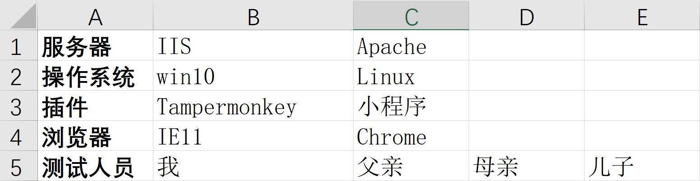
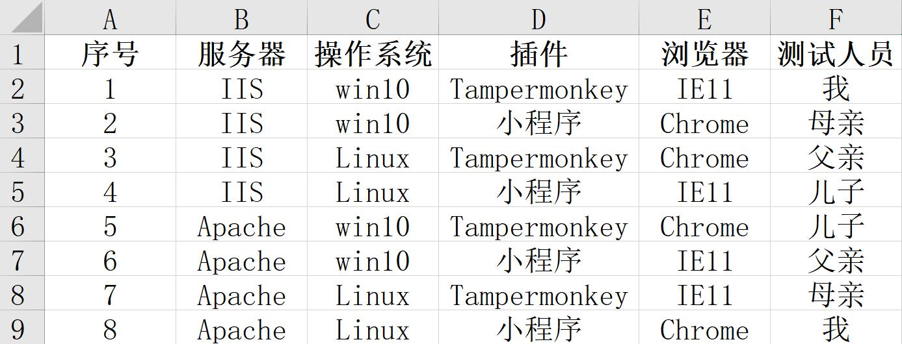

# 正交表测试用例生成工具

## 快速开始

* 输入因素数和水平数到搜索框

> 例如：输入4因素和3水平需要输入3^4，按下回车键搜索

* 选择与对应正交表相匹配的Excel文件上传

下图是一个**2^4 4^1**的Excel文件。每一行对应一个因素，每一行的第一列是因素名称

> 操作方式：将鼠标悬浮到搜索结果的正交表上，点击即可

* 等待下载

下图是生成的结果

## 可能会遇到的问题

如果没有反应请刷新浏览器
如果是读取静态资源错误建议直接换个浏览器
如果是读写Excel文件过程中的问题建议~~换个人~~检查一下格式是否正确（Execl文件后缀是xlsx）

## 缺陷

超过10水平数无法处理

## 快乐找茬

[点击此处获取一些测试用例](../input/TestCases.zip)